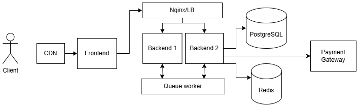
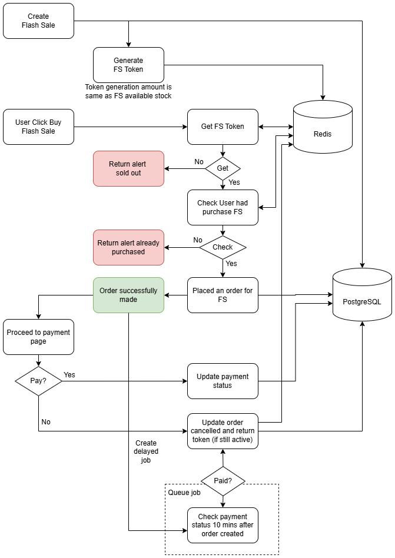

# Flash Sale Platform

This project implements a simplified **flash sale platform** designed to handle extremely high concurrency while preventing overselling and enforcing a one-item-per-user policy.

The system simulates a real-world flash sale scenario where thousands of users attempt to purchase a limited-stock product simultaneously.

## System Architecture



The following stacks are chosen for this flash sale project:

### Backend

- **NestJS**

Coming from Java Spring boot background, this is the closest Javascript framework similar to Spring Boot, which provides a similar architecture:

- Modular structure
- Dependency Injection
- Clear separation of concerns
- Built-in testing support

### Frontend

- **React**
- **Tailwind CSS**

A minimal UI is implemented to simulate user purchases and test flash sale behavior.

### Database

- **PostgreSQL**

Used for persistent storage of orders and product information.

### Cache / Concurrency Control

- **Redis**

Redis is used for concurrency control to make sure that purchase can be made smoothly without overselling.

### Queue

- **Redis Queue (BullMQ)**

Used to decouple API requests from order processing and prevent database overload during high traffic. We can use alternative queue but with the one that have delayed job because we need this to expire order.

### To be implemented in production

- **CDN**: To distribute static content as we ship the frontend built/assets to client
- **Load Balancer/Nginx**: To distribute the traffic between instance and to add network rules (rate limit, robot, etc) to harden the security and availability
- **Observability**: To store and analyze the log of the system.

## Flow Diagram


High-level purchase flow:

1. Admin create flash sale
2. Generate flash sale token upon creation
3. User click buy on flash sale
4. API purchase flash sale receive the request
5. Redis enforces **one purchase per user**
6. Return 400 if user already purchase, otherwise proceed
7. Redis **atomically allocates stock token**
8. Return 400 if not getting token (sold out), otherwise proceed
9. If token exists → request accepted
10. Order creation is pushed into queue
11. Worker processes order and stores it in PostgreSQL
12. If user pay, update order payment status
13. If user not pay or abandon order, it will release the stock after 10 minutes to increase available stock to purchase

## Non-functional requirements

### Throughput and Scalability

During flash sale events, the system may receive a large number of simultaneous purchase requests.

Design strategies used:

- **Redis-based inventory tokens** to handle high-frequency operations in memory
- **Asynchronous order processing** via message queue to protect the database
- **Stateless API services** that can be horizontally scaled across multiple nodes.
- **Redis as the primary concurrency control layer** to reduce database contention

This architecture allows the system to scale horizontally by adding more API servers and workers.

### Robustness and Fault Tolerance

Flash sale systems must remain stable even when partial failures occur.

Design strategies used:

- **Delayed expiration job** to handle idle order that has not been paid due to user idle or other issue. It will make the quantity recover upon expired.
- Queue-based order processing with **automatic job retries**. The write to database was delayed with queue and it will be process accordingly.

### Concurrency Control

This is to prevent oversell from the allocated slot. System guarante that user can only purchase once for a flash sale.

System used 2 Redis to achieve the goal:

- It will add email to Redis set

```bash
SADD flash_sale:<flash_sale_id>:buyers email
```

- If its success, then we pop the token that being generated upon flash sale creation. If user getting the token, the it can proceed to place an order.

```bash
RPOP flash_sale:<flash_sale_id>:tokens
```

## How to Run the project

### Prerequisites

- Docker
- Docker Compose

### Steps

1. Clone the repository
2. Run `docker-compose up -d`
3. Make sure all services up
4. Access on `http://localhost:8080` for landing page

If you need to run individually, make sure that you have PostgreSQL and Valkey running for backend service. Update `.env` with reference to `.env.example` in both folder to set the variable accordingly

## How to test the project

Unit test only available for backend and its utilize `jest`

### Steps:

1. Open `backend` folder
2. Check `docker-compose.yml` to see if any port that has been used and change accordingly
3. Run `npm test`

## How to stress test the project

1. Open the page for testing at `http://localhost:8080/test`
2. Add target selection to add new flash sale for existing item with custom available stock and duration
3. Select test parameters whether it distributed with email generation for number if request or burst mode with the same email
4. Click initiate sequence to simulate purchase

## Footnote

The design and development of this system is utilizing combination of multiple AI tools: ChatGPT (for design), Antigravity (for code assistance), Deepseek (for second opinion)
